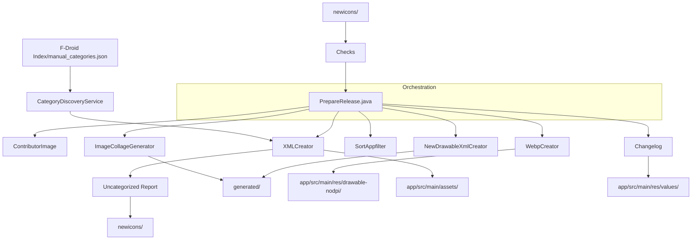

# preparehelper Architecture

This document outlines the architecture and data flow of the `preparehelper` utility, which automates icon management and release preparation for the Snow project.

## Overview
`preparehelper` is a Java-based orchestration tool designed to process raw icon assets (SVGs in `newicons/`) and integrate them into the Android project structure (asset files, XML configurations, and documentation).

## Data Flow Pipeline

The following diagram illustrates the pipeline orchestrated by `PrepareRelease.java`:



## Key Components

| Component | Responsibility |
| :--- | :--- |
| `PrepareRelease` | **Orchestrator.** Defines tasks, orchestrates parallel execution, and sets up environment paths. |
| `WebpCreator` | Converts SVGs to WebP. Handles color transformations for variant generation. |
| `XMLCreator` | Merges new icon entries into the main `appfilter.xml` and `newdrawables.xml`. |
| `Changelog` | Generates changelog files based on icon count changes and release notes. |
| `Checks` | Validates icon presence and configuration before processing. |

## Icon Management Workflow
1.  Place new icons in `newicons/`.
2.  Update `newicons/appfilter.xml` with corresponding component mappings.
3.  Run `PrepareRelease` to trigger the automated pipeline.
4.  The tool processes assets, generates necessary XMLs, and prepares the release image.

## Known Limitations
- **Icon Generation**: SVG processing in `WebpCreator` currently fails to correctly generate black variants for icons lacking explicit outline/stroke definitions.

## Icon Categorization Logic
`XMLCreator` manages icon categorization using a dual system:

1.  **Thematic Categorization**: Icons are first categorized based on a local snapshot of the F-Droid index (`preparehelper/data/index-v1.json`) or fallback naming conventions (e.g., `folder_` -> "Folders", `calendar_` -> "Calendar").
2.  **Alphabetical Categorization**: Simultaneously, icons are assigned to an alphabetical category (A-Z) based on their filename. 

**Note on Index Snapshot**: To ensure build stability and reproducibility, the F-Droid index is no longer fetched over the network during the build. It is manually maintained as a snapshot in `preparehelper/data/index-v1.json`. Update this file periodically to refresh thematic categorization data.

**Procedure for Updating the Index Snapshot**:
1. Download the latest index: `curl -o preparehelper/data/index-v1.json https://f-droid.org/repo/index-v1.json`
2. Commit the updated file to the repository.

**Exclusion Logic:**
To prevent redundancy, specific categories can be excluded from alphabetical listing. This is managed via the `NON_ALPHABETICAL_CATEGORIES` set in `XMLCreator.java`. If an icon is successfully assigned to a category listed in this set, it will **not** be added to the A-Z alphabetical lists.

To add new categories to this exclusion list, update the `NON_ALPHABETICAL_CATEGORIES` set in `XMLCreator.java`:
```java
private static final Set<String> NON_ALPHABETICAL_CATEGORIES = Set.of("Folders", "Calendar", "YourNewCategory");
```
