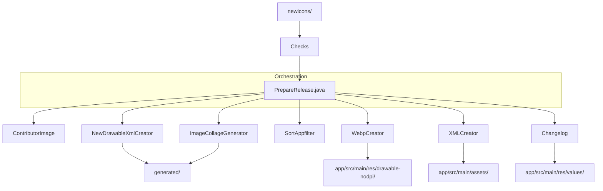

# preparehelper Architecture

This document outlines the architecture and data flow of the `preparehelper` utility, which automates icon management and release preparation for the Snow project.

## Overview
`preparehelper` is a Java-based orchestration tool designed to process raw icon assets (SVGs in `newicons/`) and integrate them into the Android project structure (asset files, XML configurations, and documentation).

## Data Flow Pipeline

The following diagram illustrates the pipeline orchestrated by `PrepareRelease.java`:

## Key Components

| Component | Responsibility |
| :--- | :--- |
| `PrepareRelease` | **Orchestrator.** Defines tasks, orchestrates parallel execution, and sets up environment paths. |
| `WebpCreator` | Converts SVGs to WebP. Handles color transformations for variant generation. |
| `XMLCreator` | Merges new icon entries into the main `appfilter.xml` and `newdrawables.xml`. |
| `Changelog` | Generates changelog files based on icon count changes and release notes. |
| `Checks` | Validates icon presence and configuration before processing. |

## Icon Management Workflow
1.  Place new icons in `newicons/`.
2.  Update `newicons/appfilter.xml` with corresponding component mappings.
3.  Run `PrepareRelease` to trigger the automated pipeline.
4.  The tool processes assets, generates necessary XMLs, and prepares the release image.

## Known Limitations
- **Icon Generation**: SVG processing in `WebpCreator` currently fails to correctly generate black variants for icons lacking explicit outline/stroke definitions.
